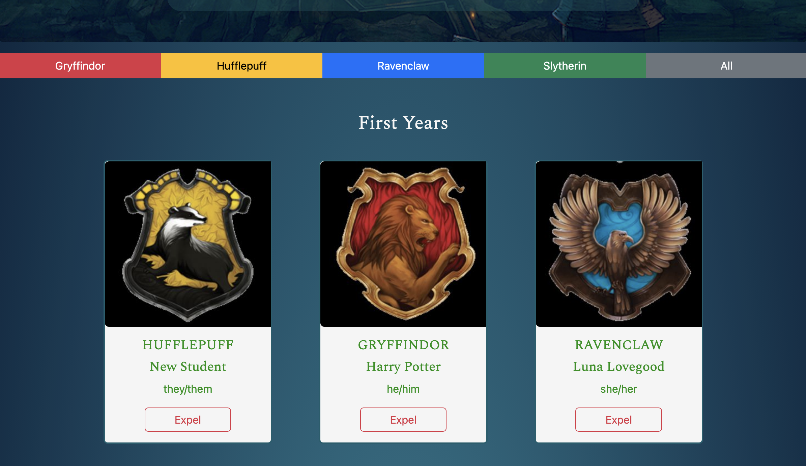
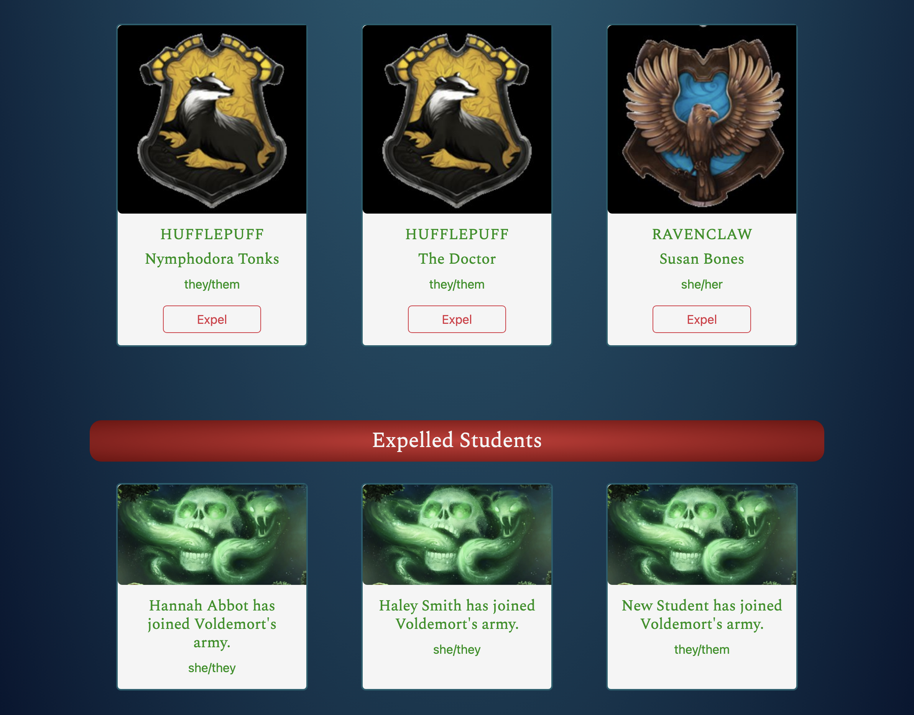

# Hogwarts Sorting Hat

[Deployed App](https://my-sorting-hat.netlify.app)

[Project Board](https://github.com/users/ursapictura/projects/1/views/1)

## Project Overview
In this project, I recreated the famous sorting hat experience from Harry Potter. Using a random number generator, every new student is sorted at random into one of the four Hogwarts Houses. Every new student is asked to provide their name and preferred pronouns. When a new student is sorted, their card will appear as the first card in the series. Each student's card shows their house crest, their name, and their preferred pronouns.

Growing up, Hogwarts was my world. I grew up believing Hogwarts was the safest place on earth, but the author of my childhood is now using her platform to destroy the safety of trans and gender non-conforming people. 

So I've created a Hogwarts where everyone is welcome. A Hogwarts where YOU choose who you are and where that choice is respected. The only thing not tolerated here are bigoted Deatheaters. Remember to respect and care for your fellow students or you'll be expelled. 

## User and Problem Being Solved
My Sorting Hat is designed for everyone who wanted to go to Hogwarts but who no oong (or never) felt welcome in that world. It's also an open-source option which means using my Sorting Hat doesn't contribute to the wealth or bloated self-importance of the author.

## Features
- add new student button
- preferred pronouns 
- expel student button
- cards displaying all first years
- cards displaying all expelled students
- house buttons that will allow the user to only see students from the chosen house
- mobile friendly

## Screenshots

